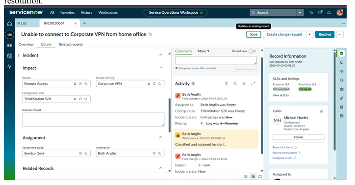
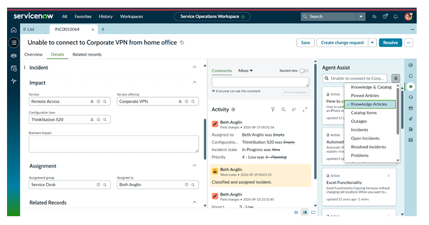
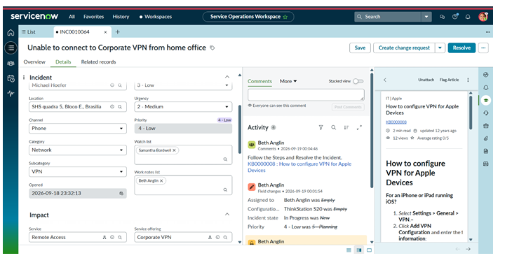
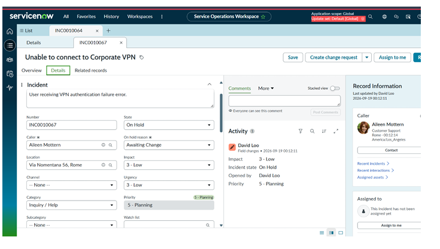
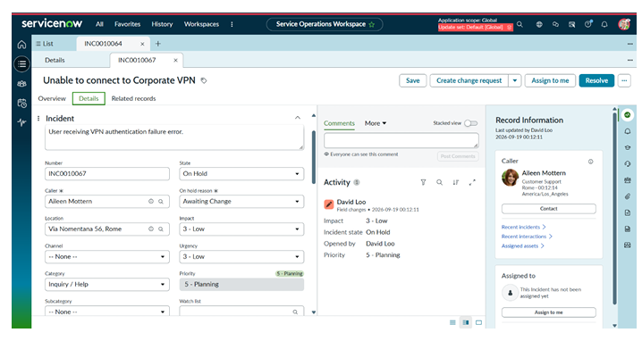

# Servicenow-incident-lifecycle-automation
Incident Lifecycle Automation project using ServiceNow ITSM
# ServiceNow Incident Lifecycle Automation

## Project Overview

This project demonstrates the automation and standardization of
the Incident Management lifecycle using ServiceNow ITSM.

## Platform
- ServiceNow

## Project Type
- ITSM
- Incident Management

## Objectives

- Create and classify incidents
- Assign incidents to support teams
- Use Agent Assist for knowledge articles
- Track SLAs
- Create emergency change requests
- Create child incidents
- Document cause and resolution
- Create knowledge articles

## Technologies / ServiceNow Features

- ServiceNow ITSM
- Incident Management
- Service Operations Workspace
- Agent Assist
- SLA Management
- Change Management
- Knowledge Management
- Service Catalog

## Project Workflow

1. Service Creation
2. Service Offering Creation
3. Incident Creation
4. Incident Classification
5. Agent Assist
6. Reassignment to Level 2
7. Level 2 Verification
8. Emergency Change Request
9. Child Incident Creation
10. Incident Resolution
11. Knowledge Article Creation
12. Final Validation

## Project Demo

🎥 [Watch the Project Demo](https://drive.google.com/drive/folders/16A_Mb2iJJ05CPORutACb2ajSRJSj_Yus)

## Screenshots

### Service Creation

### Incident Creation

### Incident Classification

### Agent Assist

### Reassignment

### Emergency Change

### Child Incident

### Resolution

### Knowledge Article

## Author
Lakshmi Prasanna Dodda
## Author

**Lakshmi Prasanna Dodda**

Aspiring ServiceNow Developer | ServiceNow Administrator

### Certifications
- ServiceNow Certified System Administrator (CSA)
- ServiceNow Certified Application Developer (CAD)
